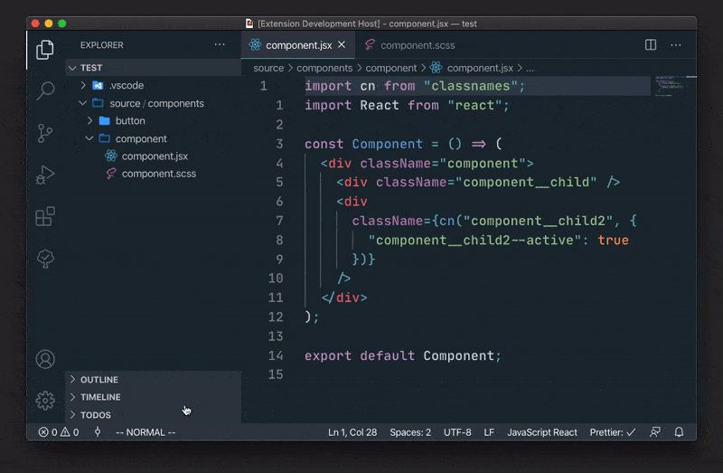

# React Rename

A VSCode extension for better renaming of React components. Renames folder, files, component identifier name, HTML class names and CSS selectors.



## How to use

- Right-click a folder or a component file in the file explorer and select `Rename React Component` towards the bottom of the context menu
- Run (`Rename React Component`) in the command palette. This will rename the currently open React component.

If the component has a folder with the same name as the component file, both will be renamed. If there are style sheets with the same name as the selected component, those files will be renamed.

Both component files and style sheets will have HTML class names replaced. Class names are only replaced in prefix position. For example, `.old-name` would be replaced with `.new-name` while `.something-old-name` would not.

## Supported file extensions

Component files: `.jsx`, `.js`, `.tsx`, `.ts`

Style sheets: `.css`, `.scss`, `.sass`, `.less`

## Configuration

### `react-rename.classNaming`

`"kebab"`, `"pascal"`, `"camel"` or `"snake"`. Defaults to `"kebab"`.

This option controls the expected casing convention for HTML class names (and class names in CSS selectors).

For example, if `"kebab"` is used when renaming a component from `OldName` to `NewName`, the CSS would be transformed like below:

```css
/* Before */
.old-name {
}

/* After */
.new-name {
}
```

If the casing convention used in files differs from what is specified in this option, renaming class names will usually not work.
